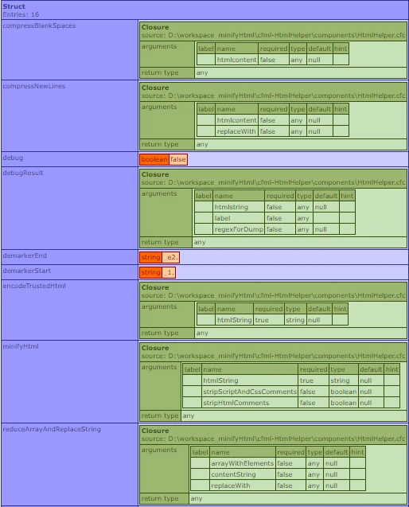

# HtmlHelper.cfc (Vers. 0.9.1)

---

***Minify your CFML generated HTML at runtime!***

If you want to see an enhanced version of this page, please visit [https://andreasru.github.io/cfml-htmlhelper/](https://andreasru.github.io/cfml-htmlhelper/)

## A simple basic CFML component to

> - **minify CFML generated html** content
> - **encode trusted HTML** content containing non-compliant/unescaped characters like e.g. &euro;, &uuml;, &ouml;, &szlig;, etc. within a tags inner HTML

### 1. minifyHtml( string html required )

#### Converts a whitespace poluted HTML block like this

            <!DOCTYPE html>
            <head>
    <title>Hot CFML Page & content</title>
                        <meta charset="utf-8">
            <meta http-equiv="X-UA-Compatible" content="IE=edge">
        <meta name="viewport" content="width=device-width, initial-scale=1">
    

        <meta name="description" content="Just some Example">
    <link rel="stylesheet" href="css/main.css">
                </head> <body>
    <!--     Say "Hello" to the CFML coders! --> 
Hello to all CFML devs 😀 🤩 around the 🌎!!! 

            </body> </html>

#### ... into a minified HTML version like this

    <!DOCTYPE html><head><title>Hot CFML Page &amp; content</title><meta charset="utf-8"><meta http-equiv="X-UA-Compatible" content="IE=edge"><meta name="viewport" content="width=device-width, initial-scale=1"><meta name="description" content="Just some Example"><link rel="stylesheet" href="css/main.css"></head><body>
Hello to all CFML devs &#x1f600; &#x1f929; around the &#x1f30e;&#x21;&#x21;&#x21; 
</body></html>

The function `minifyHtml()` minifies CFML generated html content by:

> - stripping HTML comments
> - stripping JavaScript multline comments
> - stripping JavaScript singleline comments
> - stripping CSS comments
> - stripping whitespaces, such as all double tabs/spaces/newlines
> - honouring and preserving the content within `<pre></pre>` or `<code></code>` tags as submitted

### 2. encodeTrustedHTML( string trustedHtml required )&#59;

#### Converts HTML from a trusted source with unencoded characters like this

    

        I tend to add "€, ä, &, é, ß" and I 
        even might tend to add a > (greater sign)
        directly into my html 😲, because I'm
        a lazy content writer and I don't like 
        adding those as html encoded characters manually!
    

#### ... into proper html like this

    
 I tend to add &quot;&euro;, &auml;, &amp;, &eacute;, &szlig;&quot; and I even might tend to add a &gt; &#x28;greater sign&#x29; directly into my html &#x1f632;, because I&#x27;m a lazy content writer and I don&#x27;t like adding those as html encoded characters manually&#x21; 

The function `encodeTrustedHTML()` detects and encodes unencoded characters, but preserves valid HTML-Entities and  HTML-Tags already present in the submitted HTML.

### 3. Examples

Example of minifying a whitespace overfilled WordPress page with `minifyHtml()`:

    <!--- /examples/cfhttpMinifyHtml.cfm: minifyHtml() --->
    <!--- Make sure to override admin setting and read template with correct charset(UTF-8) --->
    <cfprocessingdirective pageEncoding="UTF-8">
    <cfscript>
        // get whitespace polluted wordpress page!
        cfhttp(method="GET", charset="utf-8", url="https://news.microsoft.com/source/", result="result" ) {};
        
        htmlHelperService=new components.HtmlHelper();
        cfcontent( reset = "true" );
        writeoutput( 
            htmlHelperService.minifyHtml( result.filecontent )
        );
    </cfscript>

Example of encoding a trusted HTML block to escape unescaped characters with `encodeTrustedHtml()`:

    <!--- /examples/encodeTrustedHtml.cfm: encodeTrustedHtml() --->
    <!--- Make sure to override admin setting and read template with correct charset(UTF-8) --->
    <cfprocessingdirective pageEncoding="UTF-8">
    <cfsavecontent variable="someHtmlBlock">
        

            I'm adding some unescaped HTML directly into my HTML! 
            I't doesn't matter if they have already been encoded or not. 
        
            E.g " &amp; or & " will both create the same source. Add
            letters like ä, ö, Ä, ü, é, punctuations like ~, >, ⁋, ※, 
            currencies like $, €, £, ¥, ₹, symbols like ©, ®, ™, Ω, 
            arrows like →, ↖, ↳, ⇗, emojis like 👋 🤚 🖐 ✋ and they will be encoded properly.
        

    </cfsavecontent>
    <cfscript>
        htmlHelperService=new components.HtmlHelper();
        cfcontent( reset = "true" );
        writeoutput( 
            htmlHelperService.encodeTrustedHtml ( someHtmlBlock )
        );
    </cfscript>

### 4. Service Functions as Lambda Expression

**HtmlHelper.cfc** passes the functions minifyHtml() and encodeTrustedHtml() as Lambda Expressions to enhance inner local scoping ([see code here at GitHub](https://github.com/andreasRu/cfml-htmlhelper/blob/cc91c88a5e744a27d5006accb5ed9e54cd5e7dc5/components/HtmlHelper.cfc#L16)):

### 5. Tips & Security Advisory

> - **IMPORTANT SECURITY NOTICE:**   `encodeTrustedHtml()` MUST NOT be used to avoid XSS, because it only encodes unencoded characters of the inner HTML (within the body of tags). This function will accept any submitted HTML, JavaScript and Styles and output it as submitted(!) without encoding it for XSS mitigation. For XSS prevention of untrusted HTML you **MUST** continue to use `encodeForHTML()`, `encodeForHTMLAttribute()`, `encodeForJavascript()`, `encodeFor...()` respectively.
> - The Regex patterns are set to work with CFMLs default 'Perl' Regex-Engine
> - When using `encodeTrustedHTML()` always make sure to keep all the charsets among the stream "in sync". Having different charsets for templates, web charset, charset http headers, or resource charsets may have unpredictable wrong html-entities and characters.
> - `encodeTrustedHTML()` is typically used when you have a fronted CMS with a HTML-Editor where you can manually add custom HTML to a database.
> - You get best performance when you use `minifyHtml()` only once during the request flow, e.g. at the end of the CFML processing. A good location could be the **Application.cfc** at the end of the `onRequest()` function.

### 6. Downloads

> - **Raw HtmlHelper.cfc component**: [Download](https://raw.githubusercontent.com/andreasRu/cfml-htmlhelper/master/components/HtmlHelper.cfc)
> - **Repository as ZIP-File**: [Download](https://github.com/andreasRu/cfml-htmlhelper/archive/refs/heads/master.zip)
> - **Example minifyHtml()**: [Download](https://raw.githubusercontent.com/andreasRu/cfml-htmlhelper/master/examples/minifyHtml.cfm)
> - **Example Cfhttp & minifyHtml()**: [Download](https://raw.githubusercontent.com/andreasRu/cfml-htmlhelper/master/examples/cfhttpMinifyHtml.cfm)
> - **Example encodeTrustedHTML()**: [Download](https://raw.githubusercontent.com/andreasRu/cfml-htmlhelper/master/examples/encodeTrustedHtml.cfm)

### 7. How to run un repository locally

To test or watch the code running locally, you'll need CommandBox as dependency:

> 1. Download the [Repository as ZIP-File](https://github.com/andreasRu/cfml-htmlhelper/archive/refs/heads/master.zip)
> 2. Unzip it
> 3. Run `server.bat` on Windows or `server.sh`on MacOs/Linux
> 4. Wait for commandBox open the browser and load the page

### 8. Remarks

I'm not taking anything for this but if you like or you're using it, I kindly ask you to donate to the **Lucee Organization** to make this awesome cfengine even better:

[Lucee Open Collective Donation](https://opencollective.com/lucee) ❤️

### 9. About

> - **Author:** Andreas at [Rhein Berg Digital](https://www.rhein-berg-digital.de), <a href="https://www.linkedin.com/in/claudio-andreas-r%C3%BCger-259000199/" target="_blank" rel="nofollow">LinkedIn</a>
> - **GitHub:** &nbsp;[cfml-htmlhelper](https://github.com/andreasRu/cfml-htmlhelper)
> - **Issues/Requests:** &nbsp;[cfml-htmlhelper issues](https://github.com/andreasRu/cfml-htmlhelper/issues)
> - **License:** &nbsp;[MIT License](https://github.com/andreasRu/cfml-htmlhelper/blob/master/LICENSE.txt)
> - **Software :**&nbsp;[Lucee CFML Engine](https://www.lucee.org/) (GNU LGPL v2.1), [CommandBox](https://www.ortussolutions.com/products/commandbox) (GNU GPLv3), [highlight.js](https://highlightjs.org/) (BSD 3-Clause License, Copyright (c) 2006, Ivan Sagalaev), [normalize.css](https://github.com/necolas/normalize.css) (MIT License, Copyright (c) Nicolas Gallagher and Jonathan Neal), [github-fork-ribbon-css](https://codepo8.github.io/css-fork-on-github-ribbon/) (MIT License, Copyright (c) 2013 Simon Whitaker)
> - **Imprint:** &nbsp;[Visit here](https://www.rhein-berg-digital.de/en/andreasru-github-io-imprint)
> - **Privacy Policy:** &nbsp;[Visit the hosters Site Policy](https://docs.github.com/en/site-policy) and the [authors](https://www.rhein-berg-digital.de/en/andreasru-github-io-privacy-policy)
